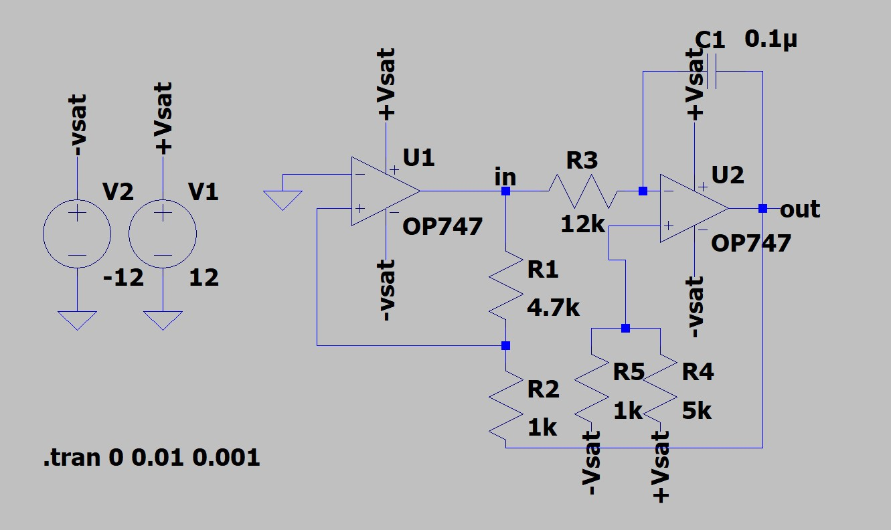

# Sawtooth-Waveform-Generator
 

Here, I have designed **Sawtooth Waveform Generator** using **LTSpice**. The difference between the triangular and sawtooth waveform is that the rise time of the triangular wave is always equal to its fall time while in sawtooth wave generator, rise time may be much higher than its fall time or vice versa. The triangular wave generator can be converted to a sawtooth wave generator by injecting a variable dc voltage into the non-inverting terminal of the integrator. This can be done by using a potentiometer as shown in first design.

 
